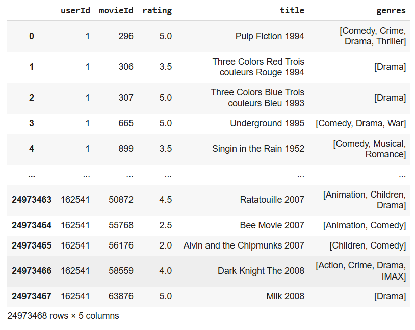
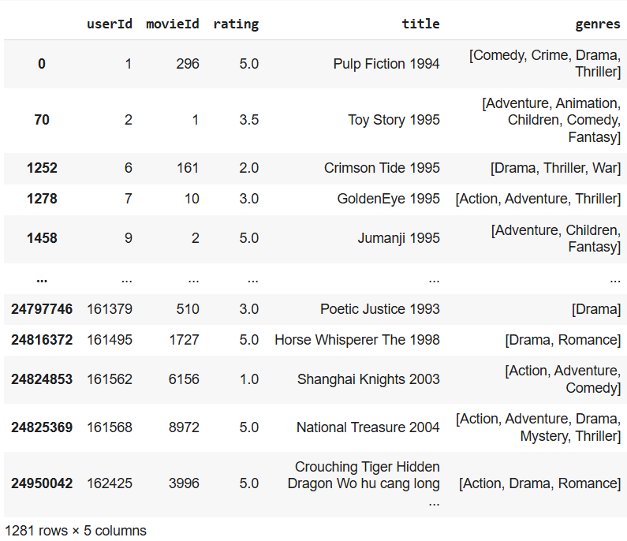
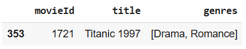
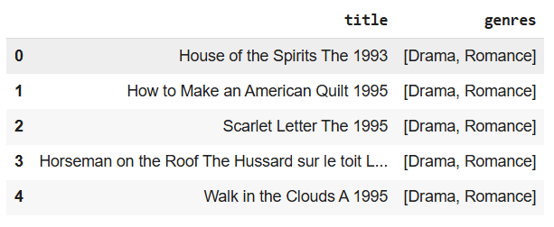
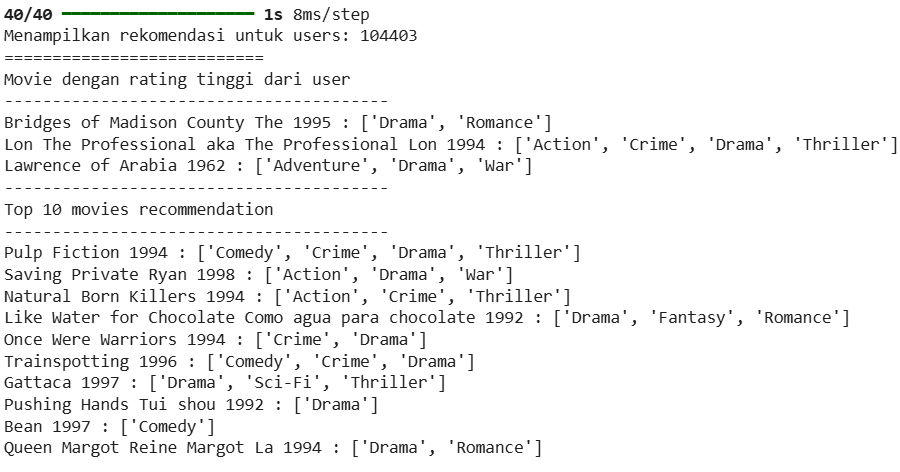
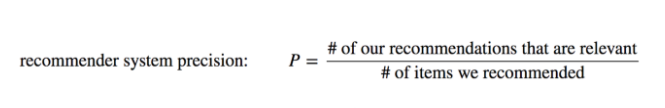
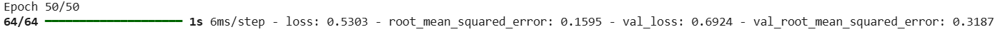

# Laporan Proyek Machine Learning | Sistem Rekomendasi - Sabina Wardaniah

## Project Overview

Sistem rekomendasi telah menjadi komponen penting dalam platform digital modern, termasuk layanan streaming film. Dengan jumlah film yang terus bertambah setiap tahunnya, pengguna sering kesulitan menemukan konten yang sesuai dengan preferensi mereka. Oleh karena itu, sistem rekomendasi yang efektif sangat diperlukan untuk meningkatkan pengalaman pengguna [1]. Proyek ini bertujuan membangun sistem rekomendasi film dengan pendekatan Content-Based Filtering dan Collaborative Filtering. Riset terkait telah menunjukkan bahwa teknik seperti collaborative filtering dan content-based filtering efektif dalam membangun sistem rekomendasi yang akurat [2].

**Referensi**

[1] Wiputra, M.M., & Shandi, Y.J., PERANCANGAN SISTEM REKOMENDASI MENGGUNAKAN METODE COLLABORATIVE FILTERING DENGAN STUDI KASUS PERANCANGAN WEBSITE REKOMENDASI FILM. Media Informatika. 1-18. [Available](https://www.researchgate.net/publication/367998636_Perancangan_Sistem_Rekomendasi_Menggunakan_Metode_Collaborative_Filtering_dengan_Studi_Kasus_Perancangan_Website_Rekomendasi_Film).

[2] Widayanti, R., dkk. (2023). Improving Recommender Systemsusing Hybrid Techniques of Collaborative Filtering and Content-Based Filtering. Journal of Applied Data Sciences. 289-302. [Available](https://bright-journal.org/Journal/index.php/JADS/article/view/115/110).

## Business Understanding

### Problem Statements

1. Bagaimana membangun sistem yang dapat memberikan rekomendasi film secara otomatis kepada pengguna berdasarkan kemiripan konten (title) dan data historis yang tersedia?
2. Bagaimana menggunakan pendekatan sistem rekomendasi berbasis kemiripan konten (content-based filtering) dan pendekatan berbasis interaksi pengguna (collaborative filtering) untuk meningkatkan relevansi rekomendasi?

### Goals

1. Mengembangkan sistem rekomendasi film otomatis yang mampu memberikan daftar film top-N kepada pengguna berdasarkan histori interaksi (seperti penilaian/rating) yang tersedia pada dataset. Dan memberikan rekomendasi film berdasarkan kemiripan konten (seperti title).
2. Mengimplementasikan serta mengevaluasi performa sistem rekomendasi dengan dua pendekatan utama dalam sistem rekomendasi, yaitu content-based filtering dan collaborative filtering, guna meningkatkan kualitas dan relevansi hasil rekomendasi yang diberikan kepada pengguna.

### Solution statements

1. **Content-Based Filtering**: Sistem ini merekomendasikan film berdasarkan kemiripan konten antar film. Teknik yang digunakan adalah `TF-IDF Vectorizer` untuk mengekstrak fitur dari kolom `genres`, kemudian menghitung cosine similarity antar film untuk menentukan rekomendasi.

2. **Collaborative Filtering**: Sistem ini menggunakan model rekomendasi berbasis Neural Collaborative Filtering menggunakan TensorFlow (RecommenderNet). Rekomendasi diberikan berdasarkan pola rating pengguna yang serupa, dan menampilkan Top 10 film dengan genre yang sama dengan genre film yang telah diberi rating tinggi sebelumnya.

## Data Understanding

Dataset yang digunakan untuk membangun sistem rekomendasi ini diperoleh dari [Kaggle](https://www.kaggle.com/datasets/parasharmanas/movie-recommendation-system/data). Dataset ini berbentuk folder yang berisi 2 file csv, yaitu:

1. [movies.csv](https://www.kaggle.com/datasets/parasharmanas/movie-recommendation-system/data?select=movies.csv): Berdimensi 62423 baris dan 3 kolom
2. [ratings.csv](https://www.kaggle.com/datasets/parasharmanas/movie-recommendation-system/data?select=ratings.csv): Berdimensi 25000095 baris dan 4 kolom

Variabel-variabel pada dataset adalah sebagai berikut:

1. **movies.csv**

- **movieId**: variabel ini berisi ID unik untuk setiap film. Ini adalah pengenal numerik yang digunakan untuk membedakan satu film dari film lainnya dalam dataset.
- **title**: variabel ini berisi judul film. Variabel ini menyimpan judul dalam format string.
- **genres**: variabel ini berisi informasi genre dari setiap film. Variabel ini menyimpan genre film dalam format string yang dipisahkan oleh '|'.

2. **ratings.csv**

- **userId**: variabel ini berisi ID unik untuk setiap pengguna (user) dalam dataset. Ini adalah pengenal numerik yang digunakan untuk membedakan satu pengguna dari pengguna lainnya.
- **movieId**: variabel ini berisi ID unik untuk setiap film. Ini adalah pengenal numerik yang digunakan untuk membedakan satu film dari film lainnya dalam dataset. Variabel ini juga muncul di dataset movies.csv dan berfungsi sebagai kunci untuk menggabungkan informasi film dan rating.
- **rating**: variabel ini berisi nilai rating yang diberikan oleh seorang pengguna (userId) untuk film tertentu (movieId). Nilai rating menunjukkan preferensi pengguna terhadap film tersebut.
- **timestamp**: variabel ini berisi informasi waktu (dalam format timestamp) kapan rating tersebut diberikan oleh pengguna.

Tahapan Univariate Exploratory Data Analysis dilakukan untuk memahami data, seperti memeriksa missing values, memeriksa data duplikat, dan melihat distribusi data. Visualisasi dilakukan menggunakan library matplotlib dan seaborn. Berikut ini kondisi dataset yang digunakan, berdasarkan tahapan eksplorasi data yang sudah dilakukan:

1. **movies.csv**

- Berdimensi (62423,2). Fitur `movieId` bertipe **int64**, `title` dan `genres` bertipe **object**.
- Tidak ada missing value dan duplicated value di setiap fitur.
- Judul masih mengandung karakter _non-alfanumeric_. Sehingga pembersihan judul film, dengan mengganti semua karakter dalam string yang bukan huruf (a-z, A-Z, 0-9, dan spasi) dengan string kosong (""), jadi judul film hanya mengandung huruf, angka, dan spasi.
- Jumlah judul film sebanyak **62298**, dengan **20** kategori genres. Dari 20 kategori tersebut terdapat kategori **'(no genres listed)'**. Baris data dengan kategori ini akan dihapus pada tahap data preprocessing.
- Pada data ini film dengan genre **Drama** paling banyak, dan disusul dengan genre **Comedy**.

2. **ratings.csv**

- Berdimensi (25000095, 4). Fitur `userId`, `movieId`, dan `timestamp` bertipe **int64**, dan fitur `rating` bertipe **float64**
- Tidak ada missing value dan duplicated value di setiap fitur.
- Pada data ini Distribusi rating bernilai `4.0` paling tinggi dan disusul dengan nilai rating `3.0`
- Rata-rata rating untuk setiap film yang ada di dataset bernilai `3.0`.
- Berdasarkan puncak grafik, rentang rating rata-rata yang paling sering diberikan oleh pengguna, berdasarkan grefik adalah rentang `3.0` sampai `4.0`.

## Data Preprocessing

1. **movies.csv**:

- Pembersihan judul film: Mengganti semua karakter dalam string yang bukan huruf (a-z, A-Z, 0-9, dan spasi) dengan string kosong (""), sehingga judul film hanya mengandung huruf, angka, dan spasi.
- Pemisahan kategori `genres`: Sebelumnya genres berkarakter string, lalu diubah menjadi `list`.
- Penghapusan baris bergenre **no genres listed**:
  Pada tahapan ini dilakukan penghapusan baris yang ber-genre **no genres listed**. Setelah dilakukan pengecekan terdapat `62423` baris dengan kategori genre tersebut. Berikut ini code yang digunakan untuk menghilangkan barisnya:

  ```
  movie_data = movie_data[~movie_data['genres'].apply(lambda x: '(no genres listed)' in x)]
  ```

  Code ini memfilter DataFrame movie_data sehingga hanya baris-baris yang genre-nya **tidak** mengandung '(no genres listed)' yang dipertahankan. Dan Otomatis jumlah genre berkurang dari `20` menjadi `19`.

2. **ratings.csv**:

- Menghapus kolom **timestamp**: Pada tahapan ini menghapus kolom `timestamp`, karena tidak diperlukan dalam sistem rekomendasi, dengan menerapkan kode:

  ```
  df_ratings.drop('timestamp', axis=1, inplace=True)
  ```

- Menggabungkan dataset: Kemudian Menggabungkan data ratings dan movies dengan menerapkan code:

  ```
  combined_data = df_ratings.merge(movie_data, on='movieId')
  ```

## Data Preparation

### Model Content-Based Filtering

Setelah menggabungkan data movies dan ratings, dataset tersebut disimpan dalam variabel `combined_data`. Berikut tampilan dataframe nya.



Dapat dilihat terdapat data duplikat di kolom `userId` dan `movieId`. Maka akan dilakukan penghapusan data duplikat di kolom-kolom tersebut teknik ini dilakukan karena untuk memastikan setiap entri dalam DataFrame tersebut unik berdasarkan kombinasi pengguna dan film. Dan ini penting untuk membangun model rekomendasi (terutama pada pendekatan Collaborative Filtering yang akan dibuat), setiap baris data biasanya diharapkan merepresentasikan satu titik data unik, yaitu rating yang diberikan oleh satu pengguna kepada satu film.

1. Menghapus data duplikat di kolom `userId`

```
combined_data= combined_data.drop_duplicates('userId')
```

2. Menghapus data duplikat di kolom `movieId`

```
combined_data= combined_data.drop_duplicates('movieId')
```

Berikut dataframe setelah menghapus data duplikat:



3. Mengkonversi semua fitur dari data series ke bentuk list dengan menerapkan code berikut:

```
user_id = combined_data['userId'].tolist()
movie_id = combined_data['movieId'].tolist()
rating = combined_data['rating'].tolist()
title = combined_data['title'].tolist()
genres = combined_data['genres'].tolist()
```

Kode tersebut mengkonversi kolom-kolom 'userId', 'movieId', 'rating', 'title', dan 'genres' dari DataFrame `combined_data` menjadi list Python. Teknik ini dilakukan untuk menata ulang data dari format DataFrame ke format list, mempersiapkannya untuk digunakan dalam pembuatan DataFrame baru (film_df). Selain itu bekerja dengan data dalam bentuk list dapat membuat akses dan manipulasi data menjadi lebih sederhana.

4. Membuat dictionary, dengan menerapkan code berikut:

```
film_df = pd.DataFrame({
    'userId': user_id,
    'movieId': movie_id,
    'rating': rating,
    'title': title,
    'genres': genres
})
```

Kode tersebut membuat DataFrame baru bernama film_df menggunakan list-list user_id, movie_id, rating, title, dan genres yang telah dibuat sebelumnya. Tujuannya adalah untuk mengkonsolidasikan data yang sudah diproses ke dalam struktur DataFrame yang bersih dan siap digunakan untuk tahapan pengembangan model sistem rekomendasi.

5. **Mengambil fitur**: Mengambil fitur `movieId`, `title`, dan `genres` dari df_cbf.
6. **TF-IDF Vectorizer**: Berikut code nya:

   ```
   from sklearn.feature_extraction.text import TfidfVectorizer

   # inisialisasi
   tf = TfidfVectorizer()

   # melakukan perhitungan idf pada data genres
   tf.fit(df_cbf['genres'].apply(lambda x: ' '.join(x)))

   # mapping  array dari fitur index integer ke fitur nama
   tf.get_feature_names_out()

   # melakukan fit lalu di transformasikan ke bentuk matrix
   tfidf_matrix =tf.fit_transform(df_cbf['genres'].apply(lambda x: ' '.join(x)))

   # melihat ukuran matrix tfidf
   tfidf_matrix.shape

   # mengubah vektor tf-idf dalam bentuk matriks dengan fungsi todense()
   tfidf_matrix.todense()

   # membuat DataFrame
   pd.DataFrame(
       tfidf_matrix.todense(),
       columns=tf.get_feature_names_out(),
       index=df_cbf.title
   ).sample(21, axis=1).sample(10, axis=0)
   ```

Data pada kolom genres, yang awalnya berupa list genre per film, digabung menjadi string dan kemudian dihitung nilai IDF-nya dengan .fit(). Kemudian, fit_transform() digunakan untuk menghasilkan TF-IDF matrix, yaitu matriks bernilai numerik yang menunjukkan seberapa penting suatu genre dalam film tertentu. Ukuran matriks dicek dengan .shape, lalu diubah ke bentuk dense matrix dengan .todense() agar lebih mudah dibaca. Akhirnya, hasilnya dikonversi menjadi DataFrame dengan nama genre sebagai kolom dan judul film sebagai indeks, kemudian diambil sampel 21 kolom dan 10 baris secara acak untuk ditampilkan.

### Model Collaborative Filtering

1. **Menggunakan DataFrame**: Disini saya menggunakan DataFrame `film_df`.
2. **Encoding fitur userId dan MovieId**: Melakukan persiapan data untuk menyandikan kolom `userId` dan `movieId` ke dalam indeks integer berurut. berikut contoh code-nya untuk `userId`:

   ```
   # mengubah userId menjadi list tanpa nilai yang sama
   user_ids = df_cf['userId'].unique().tolist()
   print('list userId: ', user_ids)

   # melakukan encoding userId
   user_to_user_encoded = {x: i for i, x in enumerate(user_ids)}
   print('encoded userId: ', user_to_user_encoded)

   # melakukan proses encoding angka ke userId
   user_encoded_to_user = {i: x for i, x in enumerate(user_ids)}
   print('encoded angka ke userId: ', user_encoded_to_user)
   ```

3. **Memetakan `userId` dan `movieId` ke dataframe yang berkaitan**

   ```
   # petakan userId dan movieId ke dataframe yang berkaitan.
   df_cf['user'] = df_cf['userId'].map(user_to_user_encoded)
   df_cf['movie'] = df_cf['movieId'].map(movie_to_movie_encoded)
   ```

4. **Pengacakan Data**: Code berikut akan mengacak urutan baris pada DataFrame `df_cf` dengan `random_search=42` sehingga menghasilkan acakan yang konsisten.

   ```
   df_cf = df_cf.sample(frac=1, random_state=42)
   ```

5. **Konversi kolom `user` dan `movie` menjadi array**, variabel x disini sebagai input model.

   ```
   x = df_cf[['user', 'movie']].values
   ```

6. **Normalisasi**: Melakukan normalisasi pada data kolom `rating` ke rentang 0-1. Kemudian hasilnya diubah menjadi array NumPy. Variabel y di sini sebagai target (label).

   ```
   y = df_cf['rating'].apply(lambda x: (x - min_rating) / (max_rating - min_rating)).values
   ```

7. **Membagi Data untuk Training dan Validasi**: Membagi data menjadi menjadi train set dan val set, 80% dari jumlah data dijadikan data latih, dan 20% sisanya dijadikan data validasi.

## Modeling & Result

Menggunakan pendekatan **Content-Based Filtering** dan **Collaborative Filtering**.

### Content-Based Filtering

1. **Consine Similarity**: Tahapan ini menghitung kesamaan antar film berdasarkan matriks, yaitu matriks numerik menggunakan TF-IDF Vectorizer. Dengan menggunakan fungsi cosine_similarity dari library sklearn.metrics.pairwise, maka akan mendapatkan matriks kesamaan (similarity matrix) di mana setiap nilai merepresentasikan tingkat kesamaan genre antar film. Semakin tinggi nilainya, semakin mirip genre kedua film tersebut.

2. **Membuat fungsi film_recomendations**: Tahapan ini membuat fungsi film_recommendations dengan beberapa parameter sebagai berikut:

- **title** : bertipe string (str), title film (index kemiripan dataframe).
- **Similarity_data** : Dataframe mengenai similarity yang telah didefinisikan sebelumnya. Bertipe data pd.DataFrame (object), Kesamaan dataframe, simetrik, dengan title sebagai indeks dan kolom.
- **Items** : Bertipe data pd.DataFrame (object). Nama dan fitur yang digunakan untuk mendefinisikan kemiripan, dalam hal ini adalah `title` dan `genres`.
- **k** : Bertipe data integer (int). Banyak rekomendasi yang ingin diberikan. Dalam project ini akan menampilkan Top-5 rekomendasi.

3. **Cara kerja fungsi `film_recommendations`**, berikut code nya:

- Mengambil kolom similarity untuk film `title` dari matriks cosine similarity (similarity_data).
- Menggunakan `argpartition` dan slicing untuk mengambil k+1 film paling mirip (termasuk dirinya sendiri).
- Menghapus film aslinya (title) dari hasil rekomendasi agar tidak muncul sebagai rekomendasi.
- Menggabungkan hasilnya dengan data items (berisi info seperti genre).
- Mengembalikan k film teratas sebagai rekomendasi.

4. **Menguji Fungsi**: Pertama menampilkan data untuk film `Titanic 1997` dengan code:

   ```
   df_cbf[df_cbf.title.eq('Titanic 1997')]
   ```

   Output:

   

   Selanjutnya menguji fungsi dengan menerapkan code berikut, dan lihat genre nya mirip dengan data untuk film Titanic 1917 diatas, yaitu Drama dan Romance:

   ```
   film_recommendations('Titanic 1997')
   ```

   

   Tujuan dari kode ini adalah untuk mendapatkan daftar film-film yang direkomendasikan berdasarkan kesamaan genre dengan film 'Titanic 1997'.

#### Kelebihan dan Kekurangan

1.  Kelebihan

- **Personalisasi tinggi**: Rekomendasi dibuat berdasarkan preferensi pengguna itu sendiri, bukan dari pengguna lain.
- **Tidak butuh banyak pengguna**: Berfungsi baik meskipun hanya ada sedikit pengguna (tidak membutuhkan data interaksi antar pengguna).
- **Dapat menjelaskan hasil rekomendasi**: Karena berdasarkan fitur konten, sistem dapat menjelaskan alasan rekomendasi (misal: genre mirip).
- **Tidak terpengaruh cold start pengguna**: Jika pengguna baru memiliki sedikit data interaksi, rekomendasi masih bisa diberikan berdasarkan konten yang mereka sukai.
- **Privasi lebih terjaga**: Tidak perlu membandingkan preferensi pengguna dengan pengguna lain, sehingga data pribadi lebih aman.

2.  Kekurangan

- **Over-specialization**: Rekomendasi cenderung terbatas pada item yang mirip dengan yang sudah disukai, sulit memperkenalkan hal baru.
- **Butuh representasi fitur yang baik**: Performa bergantung pada kualitas data fitur (misalnya genre, deskripsi, dll). Jika fitur tidak informatif, rekomendasi jadi kurang akurat.
- **Cold start item**: Item baru tanpa informasi konten atau metadata tidak dapat direkomendasikan.
- **Sulit menangkap selera kompleks**: Tidak mampu memahami konteks perilaku pengguna secara luas seperti collaborative filtering.

### Collaborative Filtering

1. **Membangun Model**: Membuat model rekomendasi berbasis Neural Collaborative Filtering menggunakan TensorFlow. Model RecommenderNet adalah neural network yang memetakan user dan movie ke dalam embedding, lalu menghitung dot product untuk memprediksi rating. Outputnya memakai sigmoid, yaitu skor kecocokan (rating yang mirip), dengan nilai antara 0 sampai 1.

- Parameter Model: `num_users` (jumlah user unik), `num_movies` (jumlah film unik), `embedding_size` (ukuran dimensi laten), `embeddings_initializer: 'he_normal'` (untuk distribusi bobot awal), dan `regularizer:l2(1e-6)` (untuk mencegah overfitting).

2. **Compile model**: Model dikompilasi dengan Binary Crossentropy untuk menghitung loss function, Adam (Adaptive Moment Estimation) sebagai optimizer dengan `learning_rate=0.001`, dan root mean squared error (RMSE) sebagai metrics evaluation.

3. **Training model**: Menjalankan proses training model RecommenderNet selama 50 epoch dengan batch size 16. Data latih (x_train, y_train) digunakan untuk melatih model, dan performa dievaluasi pada data validasi (x_val, y_val) setiap epoch untuk memantau overfitting atau peningkatan performa.

4. **Menguji model**: Menggunakan fungsi dari model.predict() dari library Keras dengan menerapkan kode berikut.

   ```
   import numpy as np

   # memastikan user_movie_array adalah numpy array bertipe float
   user_movie_array = np.array(user_movie_array, dtype=np.float32)

   ratings = model.predict(user_movie_array).flatten()

   # urutkan berdasarkan skor prediksi tertinggi
   top_ratings_indices = ratings.argsort()[-10:][::-1]

   # ambil ID movie yang direkomendasikan
   recommended_movies_ids = [
     movie_encoded_to_movie.get(movie_not_watched[x][0]) for x in top_ratings_indices
   ]

   # print hasil
   print(f'Menampilkan rekomendasi untuk users: {user_id}')
   print('=' * 27)
   print('Movie dengan rating tinggi dari user')
   print('----------------------------------------')

   top_movie_user = (
     movie_watched_by_user.sort_values(by='rating', ascending=False)
     .head(5)
     .movieId.values
   )

   movie_df_rows = movie_df[movie_df["movieId"].isin(top_movie_user)]
   for row in movie_df_rows.itertuples():
     print(row.title, ':', row.genres)

   print('----------------------------------------')
   print('Top 10 movies recommendation')
   print('----------------------------------------')

   recommended_movies = movie_df[movie_df['movieId'].isin(recommended_movies_ids)]
   for row in recommended_movies.itertuples():
     print(row.title, ':', row.genres)
   ```

   **Output**:

   

   Berhasil! Hasil diatas adalah rekomendasi untuk user dengan id 104403. Dari output tersebut, sistem membandingkan antara film dengan rating tinggi dari user dan top 10 film rekomendasi untuk user.

   10 Rekomendasi film (dan dilihat dari genre) yang diberikan sesuai dengan, film yang sudah diberi rating tinggi oleh user tersebut.

#### Kelebihan dan Kekurangan

1. Kelebihan

- **Tidak butuh data konten (fitur item)**: CF hanya memerlukan interaksi pengguna (rating, klik, dll), tidak perlu metadata seperti genre atau deskripsi.
- **Dapat menemukan pola yang kompleks**: CF bisa menangkap hubungan tidak langsung antar item dan pengguna berdasarkan perilaku kolektif.
- **Mampu memberikan rekomendasi lintas kategori**: Misalnya, seseorang yang suka film A juga menyukai film B yang sangat berbeda kontennya, karena pola perilaku pengguna lain.
- **Semakin banyak data pengguna, makin akurat**: Model menjadi lebih baik seiring meningkatnya interaksi pengguna.

2. Kekurangan

- **Cold-start problem**: Sulit merekomendasikan untuk pengguna atau item baru yang belum memiliki riwayat interaksi.
- **Sparsity**: Matriks user-item seringkali sangat jarang terisi (banyak nilai kosong), yang dapat menurunkan akurasi.
- **Scalability**: Semakin banyak pengguna dan item, semakin besar dan berat komputasi yang diperlukan.

## Evaluation

Pada proyek sistem rekomendasi ini, evaluasi dilakukan secara berbeda untuk masing-masing pendekatan:

### 1. Evaluasi Content-Based Filtering

Pendekatan **content-based filtering** menghasilkan rekomendasi berdasarkan kemiripan antar deskripsi (genre) film menggunakan TF-IDF dan cosine similarity. Evaluasi dilakukan menggunakan Metrik `Precision@K`.
Berikut ini formulanya:



Hasil Rekomendasi:


Berdasarkan hasil rekomendasi di atas, diketahui bahwa film Titanic 1997 termasuk ke dalam kategori genre `Drama, Romance`. Dari Top 5 film yang direkomendasikan, semua film memiliki kategori genre `Drama, Romance` (similar). Artinya, Precision sistem sebesar 5/5 atau 100%.

Cara kerja sistem rekomendasinya: Untuk film acuan `"Titanic 1997"` sistem berhasil merekomendasikan film seperti `"Scarlet Letter The 1995"` dan `"Walk in the Clouds A 1995"` yang memang memiliki kesamaan genre. Berdasarkan evaluasi ini, sistem menunjukkan kinerja yang baik dengan nilai Precision sebesar 100%.

### 2. Evaluasi Collaborative Filtering

Pendekatan **collaborative filtering** menggunakan metrik evaluasi **Root Mean Square Error (RMSE)**.

#### Penjelasan Metrik:

- **RMSE (Root Mean Square Error)**: Mengukur seberapa besar deviasi rata-rata antara nilai prediksi dan nilai aktual. RMSE sensitif terhadap outlier.
  
- **Cara Kerja RSME**:
  - RMSE menghitung selisih antara rating yang diprediksi oleh model dan rating aktual yang diberikan oleh pengguna pada data validasi.
  - Setiap selisih ini kemudian dikuadratkan. Tujuannya adalah untuk memberikan bobot yang lebih besar pada kesalahan yang lebih besar, dan juga untuk menghilangkan tanda negatif dari selisih.
  - Nilai kuadrat selisih ini kemudian dirata-ratakan di seluruh prediksi pada data validasi. Ini memberikan ukuran rata-rata kesalahan kuadrat.
  - Akhirnya, akar kuadrat dari rata-rata kuadrat selisih ini diambil. Inilah yang memberikan nilai RMSE. Mengakar kuadratkan ini mengembalikan unit pengukuran kembali ke skala rating awal, sehingga lebih mudah diinterpretasikan.
- **Alasan digunakan Metrik ini**:
  - RMSE memberikan ukuran seberapa jauh rata-rata prediksi model dari nilai sebenarnya. Semakin kecil nilai RMSE, semakin baik kinerja model dalam memprediksi rating.
  - Karena RMSE memiliki unit yang sama dengan skala rating, hasilnya lebih mudah dipahami dalam konteks rating film (misalnya, RMSE 0.5 berarti rata-rata kesalahan prediksi adalah sekitar 0.5 poin rating).

#### Hasil Evaluasi:

- RMSE: **0.3187**

  

  Nilai RMSE yang relatif rendah menunjukkan bahwa model mampu memprediksi rating pengguna terhadap film secara cukup akurat.

### Metriks RMSE


Berdasarkan metriks sepertinya ada indikasi overfitting, karena garis kuning (test) tidak ikut menurun. Saya sudah mencoba menangani masalah overfitting ini dengan:

- Meningkatkan nilai regularisasi.
- Menambahkan Dropout 0.1, 0.3, 0.5.
- Menginisialisasi EarlyStopping callback.

  ```
  early_stopping = EarlyStopping(
      monitor='val_loss',
      patience=5,
      restore_best_weights=True
  )
  ```

- Mengurangi jumlah embedding_size dari 50 ke 20, 30, 10.
- Melatih model dengan epoch 10, 30, 50, 100

Namun kurva `test` (data validasi) tetap berhenti menurun.

---

Secara keseluruhan, pendekatan **collaborative filtering** (dengan evaluasi kuantitatif RMSE ) dan **content-based filtering** (dengan evaluasi kualitatif) memberikan hasil yang seimbang antara presisi prediksi dan relevansi konten.

**---Ini adalah bagian akhir laporan---**
